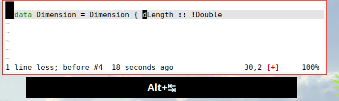
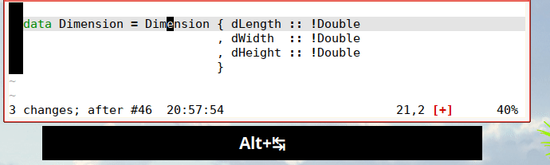

# OVERVIEW
This script allows to indent and align text with the beginning of the
words of the previous (lines) using standard tab and indent commands.
It does so by setting tab stops dynamically to the beginning of the
words of the previous line(s). Because it  only set the tab stops (using
|'vartabstops'|), all
normal insert command such as `<C-T>`, `<C-D>`, and `<Tab>` can be used
to align words with the previous line.
This plugin has been developed mainly to indent Haskell code but could
also used to align tables or anything where text needs to be aligned with
the previous line.

   

For example, we want to enter the following text :

    data Dimension = Dimension { dLength :: !Double
                               , dWidth  :: !Double
                               , dHeight :: !Double
                               } deriving (Show, Eq, Ord)

After having typed the first line the tab stops will be as follow :

    data Dimension = Dimension { dLength :: !Double
         ^         ^ ^         ^ ^       ^  ^
         |         | |         | |       |  |

Pressing `<tab>` 4 times will move the cursor at the required position.

# DETAILS
This plugins works by setting |'vartabstops'| and |'colorcolumn'| dynamically
when entering insert mode or starting a newline.
By default tab stops are set to match the beginning of the words of the
previous line but also the words of the lines above if they are before
the indentation of the current line.
This allows to get the correct indentation when indenting backward.
When starting to use this plugin it might be usefull to turn on visible
stops by pressing `<leader>wC`.
Visible stops uses |'colorcolumn'| to display the computed tab stops.

    makeSupplierPaymentAlloctionFields tags transactions = do
      let allocMap = extractSupplierPaymentToAllocateInformation tags
      ^   ns = [ n+1
      |   ^    | (fieldname, _) <- toList allocMap
      |   |    ^ ^           X  ^  ^      ^
      |   |    | |           X  |  |      |

Note, that the tab below `_` is skipped (see |disabling-temporarily|)

While in insert mode, pressing `<Tab>` or usisg `<C-T>` `<C-D>`, will work
as expected.

## SHIFTING
Shifts (`<` and `>`) should also works as expected (with repeat)

    

## DISABLING TEMPORARILY

This result in a normal tab behavior. |word-indent|  stays disabled until
the exit of insert mode
or when `<S-Tab>` is pressed again.

## SKIPPING PAIRS
Also, if  `word_indent_pairs` is set, words (or spaces) within matching
pairs will be skipped.
It is a dictionary where the key is the opening character and the value
the closing character.
The default value is `{'(': ')', '[': ']', '{': '}', '''': '''', '"': '"'}`.

## AUTOMATIC MODE
|word-indent| is enabled by default. When on, tab stops are set when
entering insert mode and each time a newline is started.
It can be toggled by calling `WordIndend#ToggleAuto`
`WordIndend#Install(false)` or using `<leader>wI`.

## PREVIOUS LINES
The line used as a reference can be moved (in insert mode) up and down using
`<C-G>j` and `<C-G>k`.
The |sign| `¶` is displayed to show which line is used as reference.
## VISIBLE STOPS
Visible stops shows the position of the tab stops. It can be toggled by
pressing `<leader>wC`.

## MANUAL STOPS
In addition to the automatic mode, stops can be set manually. A stop can
be set either on the current position using `<leader>ww` or using a regexp
by  pressing `<leader>ws`; a stop will be inserted at the beginning of
all matches.
Once a manual stop as be set, the automatic mode is disabled until all
stops are cleared.

## SIGNS
The |sign| `¶` is displayed to show which line is used as reference.
`'signcolumn'` is set to yes because setting it to auto results in the sign
column appearing/disappearing and the main buffer being shifted every time
insert mode is entered/leaved.
To hid the sign column use `set scl=no`.

# MAPPING
## NORMAL MAPPING and LEADER
By default all the normal mapping start with `<leader>w`. This can be
set to something else by setting `g:word_indent_leader`. The list of the
default mapping is

- `<leader>ww` set word stops to the current line.
- `<leader>wk` move the current line up (if set).
- `<leader>wj` move the current line down (if set).
- `<leader>wW` clear all manual stops

- `<leader>wa` add a stop at the current column
- `<leader>wA` add a stop at the current column and delete all other

- `<leader>wc` copy `'colorcolumn'` to `'varsofttabstop'`
- `<leader>wv` copy `'varsofttabstop'` to `'colorcolumn'`
- `<leader>wC` toggle visible stops

- `<leader>wi` toggle auto indent
- `<leader>wI` toggle auto mode

## INSERT MAPPING
For technical reasons, `<C-D>` needs to be remapped which break the natural
`0<C-D>` behavior.
The equivalent can be achieved with `<C-G>0`. Apart from that, `<C-D>`
and `<C-T>` work as expected.

- <S-Tab>      toggle auto mode and insert a tab
- <C-G><C-G>   toggle auto mode
- <C-G>0       same as |i_0_Ctrl_D| Delete all indent in the current line.
- <C-G><Tab>   Delete all indent an insert tab
- <C-G><S-Tab>   Delete all indent indent once

# OPTIONS
`g:word_indent_leader` set the leader for the normal mappings.

`g:word_indent_pairs`  dictionary where the key is the opening character
and the value the closing character.
The default value is `{'(': ')', '[': ']', '{': '}', '''': '''', '"': '"'}`.

`g:word_indent_auto_cc` if `1` show visible stops.

